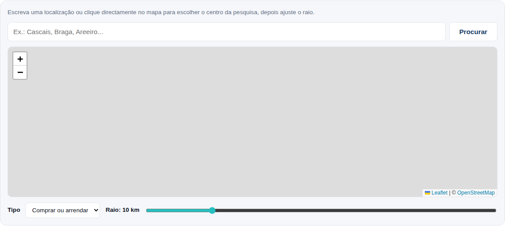
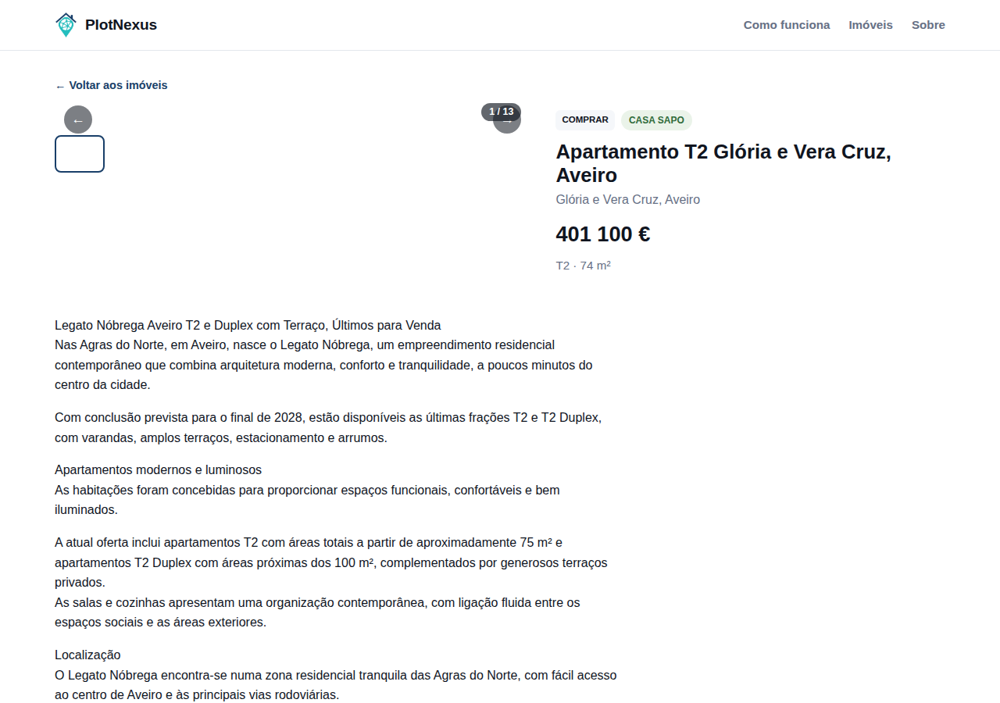

# PlotNexus

**Todos os imóveis. Uma só pesquisa.**

O PlotNexus é um hub de pesquisa de imóveis para Portugal: em vez de procurar
casa espalhado por vários sites, agrega os anúncios num único lugar, sempre
com link direto para o anúncio e site de origem. É um projeto pessoal, ainda
em desenvolvimento.

O site está publicado via GitHub Pages a partir deste repositório.

## Capturas de ecrã

**Página inicial** — pesquisa, filtro por tipo (comprar/arrendar), fontes
agregadas identificadas por cor e listagem de imóveis:


**Pesquisa por raio num mapa** — escolha de um centro (por morada ou clique
directo no mapa) e um raio de distância:



**Página de detalhe de um imóvel** — galeria de fotos, descrição completa e
link directo para o anúncio original:



## Estado atual

- Interface estática (HTML/CSS/JS puro, sem build necessário): página
  inicial com pesquisa/filtros/ordenação e pesquisa por raio num mapa
  (Leaflet + OpenStreetMap, com geocodificação de moradas via Nominatim),
  página de detalhe por imóvel (galeria de fotos, descrição completa,
  características, dados técnicos, mapa e link para o anúncio original) e
  página "Sobre".
- Conectores de dados reais e automáticos, correndo via
  `.github/workflows/scrape.yml` a cada 6 horas:
  - **CASA SAPO** — compra e arrendamento de apartamentos e moradias,
    cobertura de Portugal Continental e Madeira (os Açores não têm
    cobertura própria nesta fonte).
  - **Imovirtual** — a mesma cobertura, mas incluindo também todas as
    ilhas dos Açores e da Madeira individualmente.
  - **RE/MAX** — cobertura nacional completa (incluindo Açores e Madeira),
    através da API de pesquisa pública do site. A descrição de cada anúncio
    é filtrada por um heurístico próprio (`lib/languageGuard.js`) que corta
    o texto assim que deteta uma mudança de idioma (alguns agentes colam a
    mesma descrição em português, inglês e espanhol seguidos no mesmo
    campo), para garantir que nunca aparece texto que não seja português no
    site.
  - **Century 21** — também através de uma API de pesquisa pública
    (`/api/properties`), sem necessidade de distinguir por distrito — a
    cobertura nacional é dividida em 12 "blocos" de páginas em vez de
    localizações. Usa o mesmo heurístico de deteção de mudança de idioma
    da RE/MAX.
  - **KW Portugal** — a API de pesquisa devolve sempre o mesmo lote fixo de
    10 imóveis por pedido, por isso a cobertura nacional (obtida a partir
    do sitemap do site, já que a API nunca devolve o link do próprio
    anúncio) é percorrida em lotes de 10 ids de cada vez, outra vez
    dividida em 12 "blocos" virtuais. Essa mesma chamada já devolve o
    detalhe completo (todas as fotos, descrição integral, dados técnicos),
    mas para não escrever tudo de uma vez num único ficheiro (isso já
    chegou a ultrapassar o limite de 100MB por ficheiro do GitHub), só um
    resumo leve é guardado na primeira passagem — o detalhe completo é
    pedido de novo, um imóvel de cada vez, através da mesma fase de
    enriquecimento gradual usada pelas restantes fontes. A descrição
    passa por uma variante do heurístico de deteção de mudança de idioma
    com granularidade linha-a-linha em vez de parágrafo-a-parágrafo (o
    heurístico aceita um padrão de divisão configurável para isto), já
    que este texto não separa sempre os parágrafos com linha em branco —
    e ainda corta em pontos adicionais específicos desta fonte (uma
    assinatura fixa em inglês, e traduções coladas sem qualquer separador
    a seguir a uma etiqueta como "ENGLISH:").
  
  A recolha nacional é dividida em 4 execuções paralelas (cada uma cobrindo
  um subconjunto de distritos/localizações de cada fonte), para que nenhuma
  execução isolada precise de fazer todos os pedidos sozinha.
- Depois de recolher a lista de anúncios, o scraper visita a página de cada
  anúncio para obter detalhe completo (todas as fotos, descrição integral,
  características por categoria e dados técnicos como estado, área útil/
  bruta, ano de construção e certificação energética). Para não multiplicar
  os pedidos contra uma fonte sensível a rate limiting, cada execução só
  enriquece um lote limitado de anúncios ainda não vistos (`data/
  listings-detail.json` guarda o que já foi obtido); a cobertura completa
  cresce ao longo de várias execuções agendadas em vez de tudo de uma vez.
  Um anúncio ainda não enriquecido mostra a foto e descrição resumida da
  página de resultados como reserva.
- Resiliente a falhas parciais: se uma pesquisa falhar numa execução (bloqueio
  de rede pontual, por exemplo), os anúncios dessa zona não desaparecem do
  site — mantêm-se os últimos dados conhecidos durante alguns dias em vez de
  serem substituídos por uma lista vazia. Só são removidos ao fim de vários
  dias sem serem vistos (presume-se vendidos/expirados).
- Dados de exemplo (`data/listings.sample.json`) servem de fallback caso
  `data/listings.json` (dados reais) ainda não exista ou esteja vazio.

## Estrutura do projeto

```
.
├── index.html                   # página inicial
├── imovel.html                  # página de detalhe de um imóvel (?id=...)
├── sobre.html                   # página "Sobre"
├── assets/
│   ├── css/styles.css
│   ├── js/
│   │   ├── shared.js             # helpers partilhados entre páginas
│   │   ├── app.js                # lógica da página inicial
│   │   ├── listing.js            # lógica da página de detalhe
│   │   └── mapFilter.js          # pesquisa por raio num mapa (Leaflet)
│   ├── vendor/leaflet/            # Leaflet auto-hospedado (sem depender de CDN)
│   └── img/
├── docs/screenshots/              # capturas de ecrã usadas neste README
├── data/
│   ├── listings.json            # dados reais (gerados pelo scraper)
│   ├── listings-detail.json     # cache do detalhe já enriquecido por anúncio
│   └── listings.sample.json     # dados de exemplo (fallback)
├── scripts/scrape/               # scraper Node.js
│   ├── index.js                  # ponto de entrada para correr tudo localmente, sequencial
│   ├── worker.js                 # ponto de entrada por shard (usado pelo GitHub Actions)
│   ├── finalize.js               # combina os shards e escreve os ficheiros finais
│   ├── lib/
│   │   ├── http.js               # fetch com retry/backoff (429 e falhas de rede)
│   │   ├── merge.js              # junção com dados anteriores + seleção de detalhe
│   │   ├── languageGuard.js      # corta descrições no ponto onde mudam de idioma
│   │   └── normalize.js
│   └── sources/
│       ├── casaSapo.js
│       ├── imovirtual.js
│       ├── remax.js
│       ├── century21.js
│       └── kwportugal.js
├── .github/workflows/scrape.yml  # agendamento do scraper
├── LICENSE
└── README.md
```

## Correr localmente

Como o site carrega dados via `fetch`, é preciso servir os ficheiros por
HTTP (abrir `index.html` diretamente com `file://` não funciona por
restrições de CORS do browser). Por exemplo:

```bash
python3 -m http.server 8000
```

Depois abre `http://localhost:8000`.

Para correr o scraper localmente:

```bash
cd scripts/scrape
npm install
node index.js
```

A variável de ambiente `SCRAPE_DISTRICTS` (lista separada por vírgulas, ex.
`SCRAPE_DISTRICTS=braga,evora`) permite testar apenas alguns distritos em vez
da lista completa.

No GitHub Actions, o mesmo trabalho corre dividido: `worker.js` trata de um
subconjunto de distritos (`SHARD_INDEX`/`SHARD_COUNT`) e escreve o seu próprio
ficheiro parcial; `finalize.js` junta os ficheiros de todos os shards com os
dados anteriores e escreve `data/listings.json` e `data/listings-detail.json`
— só este último passo faz commit, por isso os shards nunca competem entre
si para fazer push.

## Nota sobre a recolha de dados de terceiros

Este projeto agrega anúncios de imobiliárias e portais de terceiros. Por
agora é um projeto pessoal e de pequena escala; antes de qualquer utilização
pública/comercial, será necessário revisitar os termos de serviço de cada
fonte. Princípios seguidos desde já:

- Nunca esconder a origem do anúncio: cada imóvel tem sempre um botão que
  encaminha para o site original.
- Respeitar limites de frequência de pedidos (rate limiting) — os scrapers
  esperam um intervalo (com variação aleatória, não fixo) entre pedidos e
  tentam novamente com backoff em caso de bloqueio ou falha de rede.
- Identificar os scrapers com um User-Agent próprio.

## Fontes investigadas mas ainda não viáveis

Algumas fontes generalistas populares usam proteção anti-bot que o método
actual (pedidos HTTP simples, sem browser) não consegue contornar:

- **Idealista** — protegido por DataDome, bloqueia mesmo o `robots.txt`.
- **SUPERCASA** — desafio Cloudflare com JavaScript obrigatório.
- **CustoJusto** — proíbe scraping explicitamente no próprio `robots.txt`.

Ultrapassar isto exigiria automação de browser completo (Playwright/Puppeteer)
e possivelmente um serviço pago de "unlocking" — um investimento de
engenharia maior que fica para mais tarde.

## Roadmap / próximas ideias

- [ ] Deteção e remoção de duplicados entre fontes (o mesmo imóvel anunciado
      tanto na CASA SAPO como no Imovirtual, por exemplo).
- [ ] Favoritos e comparação entre imóveis.
- [ ] Alertas por email para novas pesquisas guardadas.
- [ ] Modo escuro.
- [ ] PWA / instalável em telemóvel.
- [ ] Internacionalização (ex.: inglês, para expatriados a comprar em PT).

## Licença

Este projeto está licenciado sob a [Licença MIT](LICENSE): permissiva,
simples e comum em projetos web deste tipo, permitindo uso, modificação e
reutilização do código (frontend) com atribuição. Note que a licença cobre o
código deste repositório; não concede quaisquer direitos sobre os dados de
imóveis de terceiros que sejam agregados.
